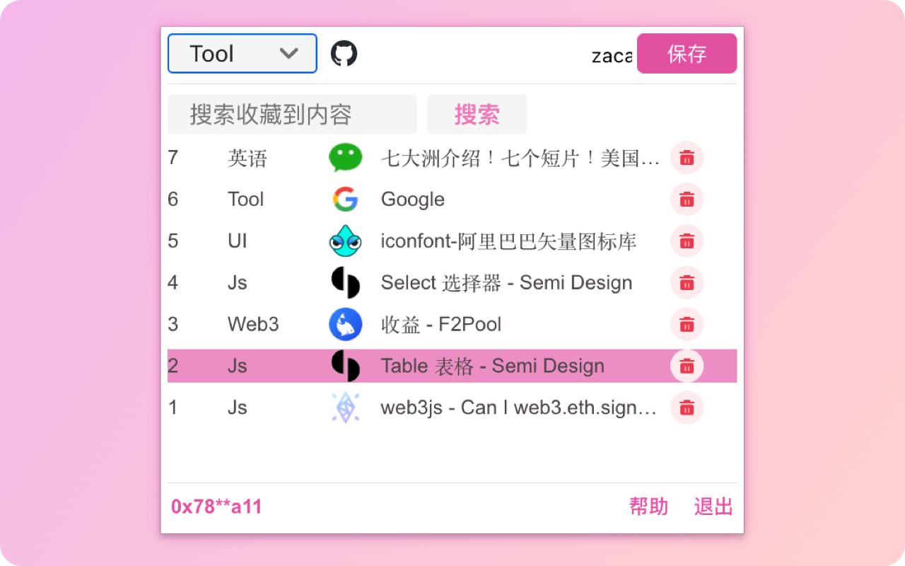

# Favme

A Browser(eg.Chrome) extension. We use github issue to interactive with our users.

# Feature
:art: mark & manage any website you like  
:rocket: support i18n  
:tada: support etherum pow account system  
:lock: use https  
:truck: support Chrome  
 
# Material & Install
## Chrome Web Store
Pending Review, Comming Soon

## Offline Crx File
<a href="./release_pkg/favme_1.0.3.crx">offline favme_1.0.3.crx</a>
<a href="./release_pkg/favme_1.0.2.crx">offline favme_1.0.2.crx</a>

# Plan

# Faq

# Contact us
Twitter: https://twitter.com/FavmeWeb3  

# ChangeLog
1.0.0 Initial  
1.0.1 Add Search Page  
1.0.2 Apply for Chrome Web Store  
1.0.3 Add Privacy Policy  
